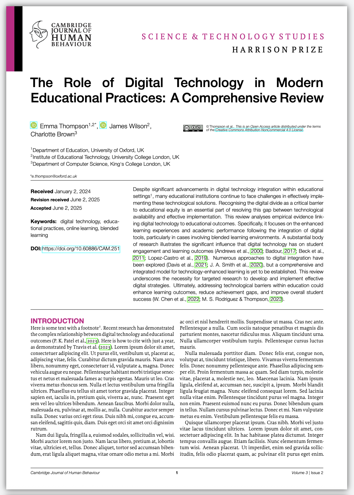

# Cambridge Journal of Human Behaviour LaTeX Style Package

A comprehensive LaTeX style package for the Cambridge Journal of Human Behaviour, designed to produce professionally formatted academic articles with support for interdisciplinary commentaries and flexible discipline-based theming.



## Overview

This package provides a complete LaTeX environment for academic publishing with the following key features:

- **Professional typography** using Proforma (body text) and Helvetica Neue (headings) fonts
- **Discipline-based theming** with customisable colours and visual elements
- **Interdisciplinary commentary system** for multi-author collaborative articles
- **Automated formatting** for figures, tables, references, and metadata
- **Flexible layout options** supporting both single and multi-column formats

## File Structure

```
latex_compiler/
├── cjhb.sty                    # Main style package
├── main.tex                    # Example article template
├── stable_tex.tex             # Alternative template
├── fonts/                      # Font files
│   ├── proforma/              # Body text fonts
│   ├── helvetica-neue-5/      # Heading fonts
│   └── PT_Serif/              # Discipline label fonts
├── images/                     # Journal assets
│   ├── article_upper_logo.png
│   ├── copyright.png
│   └── orcid.png
└── references/                 # Bibliography files
    ├── references.bib
    └── commentary_references.bib
```

## Quick Start

1. **Basic Setup**: Include the package in your document
   ```latex
   \documentclass[12pt]{article}
   \usepackage{cjhb}
   ```

2. **Define Disciplines**: Set up discipline theming
   ```latex
   \definediscipline{PSYCHOLOGY}{132,75,158}
   \definediscipline{SOCIOLOGY}{199,21,133}
   ```

3. **Article Metadata**: Configure article information
   ```latex
   \setarticletitle{Your Article Title}
   \setarticleshorttitle{Short Title}
   \setauthorheadingandcopyright{Author Name}
   ```

4. **Authors and Affiliations**: Define author information
   ```latex
   \author*[1,2]{\fnm{First} \sur{Last}}
   \affil[1]{\orgdiv{Department}, \orgname{University}, \country{Country}}
   ```

5. **Start Document**: Begin the main content
   ```latex
   \startarticlebody
   ```

## Key Customisation Options

### Discipline Theming
- **Multiple Disciplines**: Define up to 4 disciplines with custom RGB colours
- **Automatic Section Colouring**: Section titles automatically adopt the first discipline's colour
- **Manual Override**: Use `\setsectiontitlecolour{r,g,b}` to override automatic colouring
- **Visual Elements**: Discipline colours appear in page stripes, banners, and section headers

### Typography and Layout
- **Font Sizes**: Customisable section and subsection font sizes
- **Spacing Control**: Adjust spacing before and after sections
- **Column Layout**: Automatic two-column formatting with single-column title page
- **Page Margins**: Optimised for A4 paper with professional margins

### Content Elements
- **Figures and Tables**: Consistent caption formatting with custom notes
- **References**: APA-style bibliography with separate article and commentary references
- **Footnotes**: Converted to endnotes with custom formatting
- **Metadata Block**: Integrated abstract, keywords, and DOI display

### Interdisciplinary Commentaries
- **Structured Format**: Dedicated commands for commentary titles, authors, and content
- **Discipline Labelling**: Each commentary can have its own discipline colour
- **Reference Management**: Separate bibliography for commentary references
- **Seamless Integration**: Commentaries flow directly from main article content

## Advanced Features

### Page Design
- **Header/Footer System**: Automatic page numbering with journal information
- **Discipline Stripes**: Visual page markers using discipline colours
- **Sideways Text**: Rotated discipline labels on page edges

### Reference Management
- **BibLaTeX Integration**: Modern bibliography management
- **Source Mapping**: Automatic keyword tagging for article vs commentary references
- **Multi-column Layout**: Three-column reference display for space efficiency

### Quality Control
- **Hyphenation Settings**: Optimised for academic text
- **Microtype Support**: Enhanced typography and spacing
- **Consistent Formatting**: Standardised appearance across all elements

## Usage Examples

### Basic Article Structure
```latex
\documentclass[12pt]{article}
\usepackage{cjhb}

\definediscipline{PSYCHOLOGY}{132,75,158}
\setarticletitle{Research Article Title}
\setarticleshorttitle{Short Title}
\setauthorheadingandcopyright{Author Name}

\author*[1]{\fnm{First} \sur{Last}}
\affil[1]{\orgdiv{Department}, \orgname{University}}

\startarticlebody
\section{Introduction}
% Your content here
```

### Adding Commentaries
```latex
\startcommentaries

\commentarydiscipline{199,21,133}{SOCIOLOGY}
\commentarytitle{Commentary Title}
\commentaryauthor{Commentary Author}
\commentaryaffiliation{Author Affiliation}

\begin{commentarycontent}
\subsection{Commentary Section}
% Commentary content
\end{commentarycontent}
```

## Technical Requirements

- **LaTeX Engine**: XeLaTeX (required for fontspec and custom fonts)
- **Font Files**: Proforma, Helvetica Neue, and PT Serif fonts included
- **Packages**: Comprehensive package dependencies managed automatically
- **Bibliography**: BibLaTeX with biber backend

## Professional Applications

This style package is designed for academic publishing environments requiring:
- Consistent journal formatting across multiple articles
- Support for interdisciplinary research collaboration
- Professional typography and layout standards
- Automated formatting to reduce production time
- Flexible theming for different research disciplines

The package maintains high typographic standards while providing the flexibility needed for modern academic publishing workflows. 
